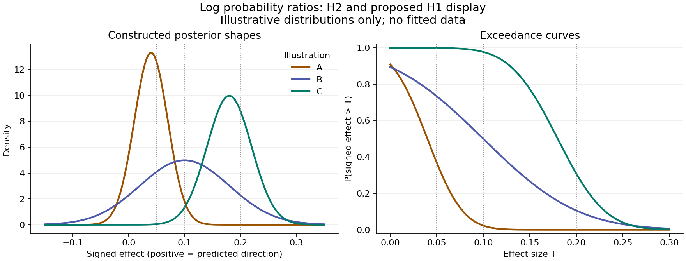
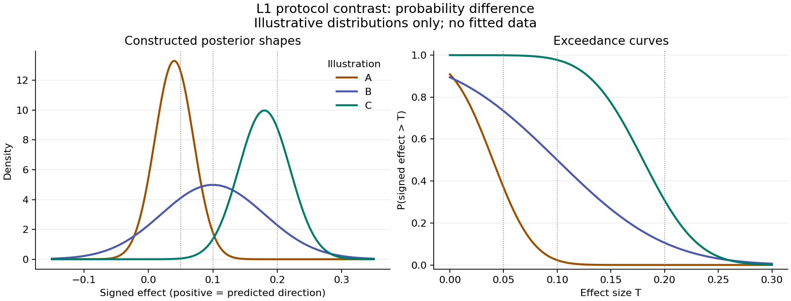
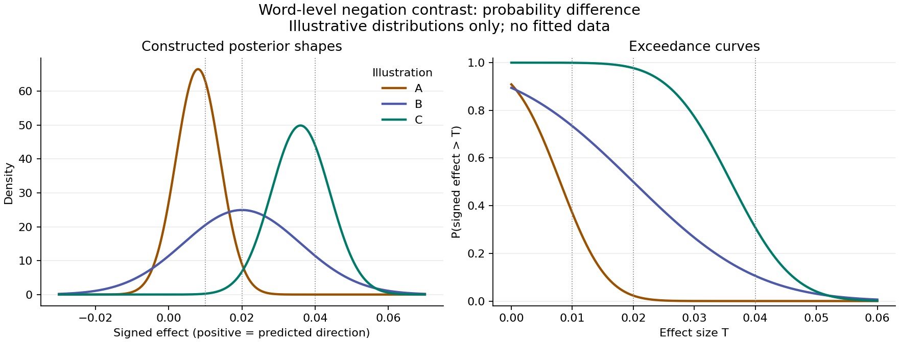

# Probability examples for interpreting effect sizes
<!-- SUMMARY: Illustrations of effect sizes, uncertainty and assumption-dependent interpretation, following Brett's decision to leave substantive benchmarks unset; no empirical or fitted simulation results · status: draft · updated: 2026-10-10 -->

**These are illustrations, not results.** Every baseline probability,
contrast size and posterior shape below is an analyst-chosen example.
None comes from a pilot, a grid or a research dataset. The purpose is to
make the size of a contrast legible. Nothing here sets a benchmark or
changes `analysis_plan.md`. Following Brett's
Roughdraft review on 2026-10-10, **the substantive benchmarks remain unset**.

Brett's reporting direction is to **report the estimated size, its
uncertainty, and how it changes under different assumptions**. Each result
should therefore lead with the effect estimate and interval on its stated
scale, give the corresponding predictive probabilities where useful, and
show the estimates across the pre-specified assumptions. Exceedance curves
can describe uncertainty across possible benchmarks without selecting one.
Any later decision label accompanies this account; it cannot replace it.

The earlier threshold proposal came from the plan's “What associations can
and can't show” and the 2026-10-09 “Thresholds” entry in `DECISIONS.md`.
The examples below explain what that proposal would add, but they do not
require its adoption. The current reporting direction is recorded in the
2026-10-10 decisions. Simulation test values and computational diagnostic
limits remain separate from judgments of scientific importance.

## H2: how much less often is a more common attribute produced?

H2 compares a focal word at within-valence commonness z and z + 1 reference
SD, averaging over marking and usage as the model specifies. Competitors,
the outside option and the other controls are held fixed. The contrast is
the mean of the log probability ratios. Higher z means more common, so the
predicted contrast is negative.

Here the event is **selection of the focal word in one categorical response
opportunity for a participant and group**, from the eligible vocabulary plus
the outside category. The probability includes that outside category in its
denominator. It is a share of selections, not the chance of appearing
anywhere in a multiword response. H1's probability examples below use this
same response event.

In D1c's six-draw Nicolas-like approximation, a constant per-draw probability
of 0.5% gives an at-least-once probability of
1 − (1 − .005)^6, about 3%, if the draws are independent. That calculation
illustrates the distinction between the two events. The eventual empirical
interpretation must state the response unit and its dependence assumptions.

For a focal comparison with log ratio −T, its probability ratio is exp(−T).
The table illustrates the special case in which every focal comparison has
that ratio. All starting probabilities are hypothetical. The percentage
point change gets larger as the starting probability rises.

| Illustrative magnitude T | Relative decrease | From 0.1% to | From 0.5% to | From 1% to |
|---|---:|---:|---:|---:|
| .05 | about 5% | 0.095% | 0.476% | 0.951% |
| .10 | about 10% | 0.090% | 0.452% | 0.905% |
| .20 | about 18% | 0.082% | 0.409% | 0.819% |

At the middle value, a probability of 0.5% becomes about 0.45%, a
decrease of about 0.05 percentage points. In a heterogeneous model,
exponentiating the mean log ratio gives a geometric mean ratio, not the
ratio of average probabilities. The eventual report therefore needs its
posterior predictive probabilities alongside the log contrast.

For a homogeneous illustration starting at 0.5%, the same changes can be
expressed as expected focal-word selections:

| Illustrative T | Relative decrease | Expected selections per 10,000 comparable opportunities |
|---|---:|---:|
| .05 | 4.9% | 50 → 47.6 |
| .10 | 9.5% | 50 → 45.2 |
| .20 | 18.1% | 50 → 40.9 |

These are expected counts, not sample-size recommendations. They require
the stated homogeneous probabilities; a heterogeneous mean log ratio does
not determine aggregate counts. H2 averages separate focal-word comparisons,
each with its competitors fixed. It does not predict that every word's
selection share can fall simultaneously under one joint vocabulary change.

Scientific importance still needs an argument. A small difference for one
infrequent word does not establish whether a systematic pattern across the
target vocabulary would change the assessment of the hypothesis. The
probability translation specifies the size; the claim, target population
and assumptions determine what that size would bear on.

Report separately for **perceived display frequency** and
**prevalence under a bridge model**. The same numerical contrast doesn't
give them the same interpretation or human support. Source-specific
applicability or expected-frequency analyses likewise need their own
construct labels and frozen reference scales. No calibration across these
constructs is supplied by this table.

## H1: the predictive comparison for formal negation

The plan keeps the frequency-held-fixed and frequency-integrated comparisons
separate. D1c expresses its held-fixed comparison as a mean log probability
ratio for formal negation versus no formal negation. **PROPOSED for the
eventual H1 display:** use this scale for each comparison, with a separately
stated averaging distribution. The integrated version needs
its own predictive calculation.

| Illustrative positive log ratio | Relative increase | From a hypothetical 0.5% to |
|---|---:|---:|
| .05 | about 5% | 0.526% |
| .10 | about 11% | 0.553% |
| .20 | about 22% | 0.611% |

This comparison concerns predicted word choice on common support. Its
size doesn't establish that morphology improves held-out prediction. H1
also requires the planned word or morphological-family holdouts, with a
specified scoring rule and uncertainty for the improvement on that score.
No minimum increment is required by this note. H1 stays exploratory and
predictive.

## How the posterior changes the interpretation

Let u be the signed effect in the predicted direction: u = −H2, u = H1
under the proposed scale above, or u = θ_m for L1. Plot P(u > T) against
possible T. With a continuous posterior and equal-tailed 90% intervals,
an interval wholly beyond T corresponds to P(u > T) > .95; an interval
wholly below T corresponds to P(u > T) < .05.

The earlier labelling proposal involved two distinct choices:

| Choice | What it specifies |
|---|---|
| Effect benchmark T | The magnitude used to summarize the scientific comparison on its stated scale |
| Posterior cutoff, here .95 | The posterior probability required beyond T to assign the corresponding label |

Here .95 follows from using equal-tailed intervals to illustrate the earlier
90% interval rule. It does not establish that T is consequential. Neither
classification choice is required for the current reporting approach. The
posterior and exceedance curve show effect size and uncertainty directly.

These three shapes are constructed normal distributions. The reuse of the
shapes across scales is a teaching device; it says nothing about how much
information any dataset contains.

| Illustration | Centre of u | 90% interval | P(u > .05) | P(u > .10) | P(u > .20) |
|---|---:|---|---:|---:|---:|
| A | .04 | [−.01, .09] | .37 | .02 | below .001 |
| B | .10 | [−.03, .23] | .73 | .50 | .11 |
| C | .18 | [.11, .25] | above .999 | .98 | .31 |

A centres on a smaller effect and B is much less precise than C. A can
favour the predicted direction while giving little probability to exceeding
.10. C gives about .98 probability to exceeding .10 but only .31 to
exceeding .20. These descriptions preserve information that a single
decision label would omit.

For example, C has about .98 posterior probability beyond .10: it crosses
a .95 cutoff and falls short of .99. Neither its estimated effect nor its
posterior changes when the reporting cutoff changes. This comparison does
not propose a new cutoff for the plan.

## L1: a difference between model-protocol response probabilities

θ_m compares the probability that a model judge calls the positive pole
rarer in the two pair types: positive pole negated versus positive pole
unnegated. It concerns a comparison under the frozen model protocol. It
isn't the prevalence of the trait among people or the probability that a
judge is correct.

In D2's implemented protocol, this probability conditions on a substantive
answer: **“can't say” is excluded from the denominator; “about equal” is
included**. One comparison uses a randomly selected wording set and averages
over the frozen model-family panel. This is the protocol underlying the
examples; the empirical protocol must state the same choices explicitly.

| Illustrative θ_m | Hypothetical reference probability | Probability in positive-pole-negated pairs |
|---|---:|---:|
| .05 | 40% | 45% |
| .10 | 40% | 50% |
| .20 | 40% | 60% |

The middle example is a ten-percentage-point difference. Other reference
probabilities give the same difference wherever both probabilities remain
valid. The process-level contrast, the contrast for the frame's own pairs,
and the within-reading contrasts keep their distinct target populations;
using a common display scale doesn't pool them.

The process contrast also averages over new lexical pairs from the stated
pair-generating population. The finite-frame contrast averages over the
particular frame's pairs, with model-response and wording variation still
present. Repeated model responses to one pair do not supply additional
lexical pairs. Each contrast therefore needs its own account of what is
being averaged and what uncertainty remains.

The numerical examples A–C above also illustrate θ_m on its probability
scale. Here the distributions are truncated to [−1, 1], the range of a
probability difference. A centre of .10 now means ten percentage points,
whereas .10 for H2 denotes a log ratio. A benchmark selected for one has
no automatic standing for the other.

## Word-level rarity and stakes comparisons

For the word-level marking prediction, use a probability difference, with
more common words predicted to have lower negation probability. Define
the commonness endpoints and the outcome being summed.
The plan's word-level claim concerns formal negation; D2's implemented
average predictive comparison concerns contrary prefixes. Those are
different outcomes and require separate interpretations.

Here the predicted event is **formal negation of a lexical type under the
frozen sense, reading and coding rules**. The illustration averages with
equal weight per lexical type, as in the simulation's word averaging. The
two columns describe model-predicted negated shares at lower and higher
commonness under that standardization. The empirical target must freeze
its type, morphological-family or token weighting for the effect to be
interpretable.

| Illustrative decrease T | Predicted negated share at lower commonness | Predicted share at higher commonness |
|---|---:|---:|
| .01 | 15% | 14% |
| .02 | 15% | 13% |
| .04 | 15% | 11% |

**PROPOSED commonness endpoints for the examples:** z − .5 to z + .5 on
the frozen reference scale, as in D2. This chooses a one-SD span; its centre
and averaging distribution are part of the definition. D1c instead shifts
z to z + 1. These contrasts needn't agree in a nonlinear model. This note
doesn't change either simulation or settle the eventual empirical contrast.

Here u is the decrease in negation probability. A, B and C have centres
.008, .020 and .036, with 90% intervals approximately [−.002, .018],
[−.006, .046] and [.023, .049]. Against T = .02, their exceedance
probabilities are .02, .50 and .98. These are again constructed examples.

For L2's stakes comparison, the same probability-difference display can
show changes in contrary-prefix probability over a frozen stakes contrast.
Report its size and uncertainty separately: arousal's status as a stakes
indicator and its reliability are assumptions, and the adjusted and
unadjusted contrasts have different conditioning. The table illustrates
the arithmetic only.

The word-based and description-based commonness analyses use the same
vocabulary and endpoints when comparing their word-level results. Display
both estimates and intervals across their admissible bias and transport
specifications, including disagreement and failed overlap. Agreement doesn't
validate either instrument, and neither analysis is selected for giving the
preferred result.

## Secondary quantities and strand A

Conditional coefficients such as b_z can have exceedance curves on their
own scale, but shouldn't take H2's benchmark by numerical resemblance. A
conditional logit shift b changes a focal probability p to
p exp(b) / [1 − p + p exp(b)], holding competitors and other predictors
fixed. H2 additionally averages marking and usage and evaluates a different
contrast. Random slopes must be included in a prediction for a given group
and participant.

For the sensitivity-based rarity-versus-valence comparison and L1's
secondary word-based slope, retain estimates and curves under each
identifying assumption. Their reference contrasts still need specification.
L1's morphological-bias tipping
point describes sensitivity to an assumed measurement bias; it isn't an
effect-size benchmark.

Strand A's fresh-sample PPV, negative share and content overlap are
simulation summaries under stated mechanisms. The settled work keeps a
forward map, not calibration from observed consensus to true group
differences. PPV is compared with the target group's share, and content
overlap with its own stated metric and sampling structure. No posterior
or three-way benchmark is invented for those existing simulation summaries.

## How these examples will be used

**Current decision (Brett, 2026-10-10): report the estimated size, its
uncertainty, and how it changes under different assumptions.** Substantive
benchmarks remain unset. No numerical choice or file-merging task is being
assigned to Brett by this note.

For each result, state the probability's event, denominator, contrast and
averaging population; report the estimate and uncertainty interval; and
translate the estimate into predictive probabilities where that helps.
Show the same quantities under the alternative bias, measurement and
transport assumptions. Keep different constructs and target populations
separate. The analyst prepares these definitions and comparisons.

Uncertainty within one fitted model and variation across assumptions answer
different questions. An interval can be narrow within every fit while the
estimates differ greatly between fits. The report must show both, without
treating the number of specifications as a probability or using their
spread as though it were one posterior interval. Any future proposal for
a scientific cutoff needs a reason before a numerical choice is requested.

## Reproduction and sources

Definitions and decision rules come from `analysis_plan.md` (“H2 details”,
“H1 details”, “Multiverse”, “L1”, “L2”, and “What associations can and can't
show”), `scripts/d1c/README.md`, `scripts/d2/README.md`, and
`reviews/codex-thresholds-2026-10-09/output.md`. These are project decisions
and specifications, not new external evidence. D2 was read only; no D2
file was changed.

`python3 notes/threshold-examples-draft-2026-10-10.py` regenerates the
figures and the accompanying JSON arithmetic record. It reads no research
data or fitted results and uses analytical distributions without random
sampling. The JSON records package versions and source hashes. Displayed
numbers are rounded; the extra digits in the arithmetic record support
reproduction, not empirical precision.

---
comments:
  c1:
    body: >-
      I’d keep these examples, but I wouldn’t yet promote any of the candidate
      values into a smallest meaningful effect. The arithmetic is sound. The
      unresolved work is to specify exactly what each probability describes and
      explain what an effect of a given size would change in the scientific
      argument. The note already allows benchmarks to remain unset; that’s the
      option I’d choose for now.

      The strongest parts are the distinctions it preserves: a reporting
      benchmark versus an effect used in design simulations; a mean log
      probability ratio versus a ratio of average probabilities; a model’s
      rarity judgments versus human prevalence; and a predictive contrast versus
      improvement in held-out prediction. I wouldn’t undo any of those
      distinctions.

      Here’s what I’d tighten.

      ## 1. Make the probability’s denominator explicit

      This is the most consequential missing information.

      For H2, what event has probability 0.5%? A focal word being selected at a
      particular response opportunity? Its appearing anywhere in a participant’s
      description? Its being selected conditional on producing an attribute from
      some eligible vocabulary? Those probabilities have different denominators.
      If people can supply several words, a word’s share of selections and its
      probability of appearing somewhere in a response are different quantities.

      The examples become easier to assess once the event is stated. For
      example, under the table’s homogeneous-ratio illustration, with a starting
      probability of 0.5%:

      | H2 benchmark | Relative decrease | Expected focal-word selections per
      10,000 comparable selection opportunities |

      |---|---:|---:|

      | .05 | 4.9% | 50 → 47.6 |

      | .10 | 9.5% | 50 → 45.2 |

      | .20 | 18.1% | 50 → 40.9 |

      These are just your arithmetic expressed as expected counts. They aren’t
      sample-size recommendations. And they inherit your restriction that the
      same probability ratio applies across the illustrated comparisons; a
      heterogeneous average log ratio doesn’t automatically imply these
      aggregate counts.

      That translation also exposes why neither the relative nor the absolute
      change settles importance. A roughly 10% reduction might be consequential
      if it’s systematic across a substantial part of the vocabulary. Looking at
      the absolute change for one infrequent word won’t establish that.

      The word-level section needs an even sharper clarification. Assuming its
      outcome concerns lexical types under a frozen reading and coding scheme,
      *negation probability* is a predictive quantity over a population of
      words. The substantive comparison is something like:

      - At the lower commonness value, the predicted formally negated share of
      the target lexical population is 15%.

      - At the higher commonness value, that predicted share is 13%, under the
      specified standardization.

      The table’s *before* and *after* wording risks suggesting that an
      individual word becomes less likely to possess its morphology. I’d
      describe the two commonness values directly. Whether the target is
      weighted by lexical types, morphological families, or tokens is then
      central to interpreting that two-point difference.

      For L1, state whether the denominator includes *can’t say* responses. Also
      distinguish variation across lexical pairs from variation across repeated
      model responses to the same pairs. Keeping the protocol fixed is
      necessary, but the reader still needs to know which probability the
      protocol defines.

      These specifications might already be settled in the analysis plan. If so,
      the note needs a compact statement of them, because they materially affect
      the benchmark judgment.

      ## 2. There are two thresholds here

      The note discusses the effect-size benchmark carefully, but treats the
      posterior-probability cutoff more quietly.

      They answer different questions:

      | Choice | What it determines |

      |---|---|

      | Effect benchmark T | Which magnitudes you’re treating as substantively
      consequential for this particular claim |

      | Posterior cutoff .95 | How much posterior probability must lie beyond T
      before the rep
    by: user
    at: 2026-10-10T13:19:24.757Z
  c2:
    body: >-
      Kept the substantive benchmarks unset and recorded that decision. Added
      the per-selection H2/H1 event, outside-category denominator, expected-count
      translation and distinction from appearing at least once. Recast the
      word-level table as standardized predicted shares across equally weighted
      lexical types at two commonness values. Stated D2's exclusion of can't-say
      responses and inclusion of about-equal responses, and distinguished new-pair
      from finite-frame averaging. Added separate explanations of T and the
      posterior-probability cutoff, with an illustration of .95 versus .99.
      These clarify the note without changing either simulation or the analysis
      plan. The saved c1 ends partway through point 2's table; this reply addresses
      the text received.
    by: Codex
    at: "2026-10-10T13:30:03Z"
    re: c1
